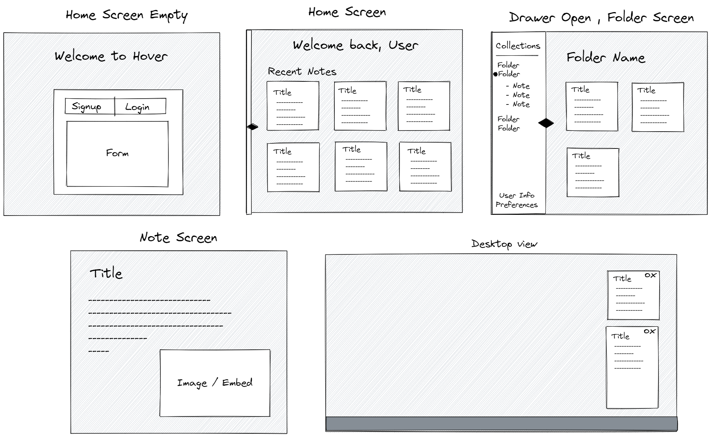
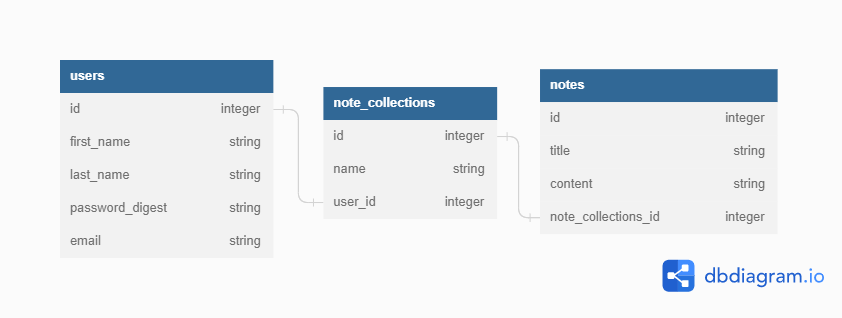

# `Hover` 🎏
### Modular Markdown Sticky Notes

 

## `To Dev:`
#### DO KNOW:
- A central "note hub" that displays all notes in their corresponding collections / folders
- A dynamic "note Screen" that only displays an individual note
- A sidebar that displays all collections and their contained notes
- User signup and login to keep track of notes
- Status bar at the bottom to keep track of word count

#### DONT KNOW:
- Text area that parses markdown
- Making notes appear on desktop in small note-sized windows
- Be able to select which / how many notes appear
- Lock/unlock button for editing when on 'Note Screen'
- Make notes comform to grid in 'folder screen'
- Make notes resizable

 

### `Stretch features:`
- Live markdown compiling
- Remembering note layout when app launches
- Importing markdown / text files
- Customizing note colors & fonts
- Customzing markdown colors & symbols
- Importing / exporting custom themes
- Kanban board style 'note board'
- Be able to link together and reference different notes

 

## UI Wireframe

## Database Schema

